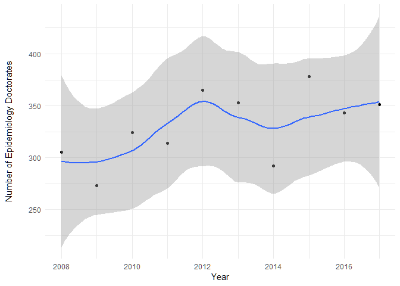
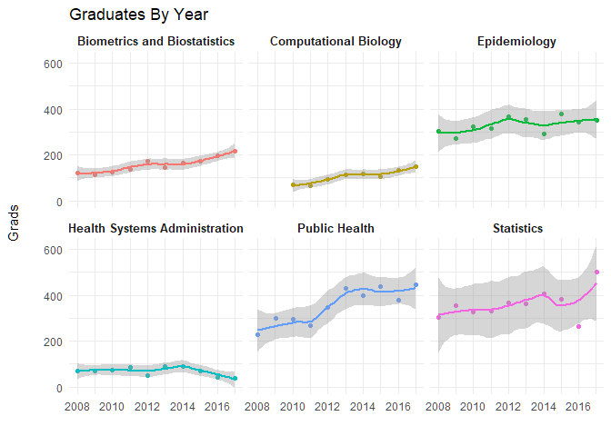

```r
library(readxl,warn.conflicts=F, quietly=T)
library(tidyverse, warn.conflicts=F, quietly=T)
library(tidyquant, warn.conflicts=F, quietly=T)
library(xts, warn.conflicts=F, quietly=T)
```


```r
tab013 <- read_excel("sed17-sr-tab013.xlsx", skip = 3)
options( warn = -1 )
```


```r
years <- list()


for(i in 1:(ncol(tab013) - 1)){
  temp <- data.frame(tab013$`Fine field of study`, tab013[, (i+1)])
  temp$Year <- colnames(temp)[2] %>% substring(2) %>% paste0("-01-01") %>% as.Date(format = "%Y-%m-%d")
  colnames(temp) <- c("Field", "Grads", "Year")
  temp$Grads <- temp$Grads %>% as.numeric()
  years[[i]] <- temp
}

Clean_Data <- do.call(rbind.data.frame, years)
glimpse(Clean_Data)
```

```
## Observations: 3,830
## Variables: 3
## $ Field <fct> All fields, Life sciences, Agricultural sciences and nat...
## $ Grads <dbl> 48777, 11086, 1198, 111, 28, 3, 68, 41, 18, 77, 182, 52,...
## $ Year  <date> 2008-01-01, 2008-01-01, 2008-01-01, 2008-01-01, 2008-01...
```


```r
labels <- c("Epidemiologyd" = "Epidemiology",
            "Public health" = "Public Health",
            "Biometrics and biostatistics" = "Biometrics and Biostatistics",
            "Health systems administration" = "Health Systems Administration",
            "Statistics (mathematics)" = "Statistics",
            "Computational biology" = "Computational Biology")

epi_plot <- Clean_Data %>% filter(Field == "Epidemiologyd") %>% 
  ggplot(aes(x = Year, y = Grads)) +
  geom_point() +
  geom_smooth() + 
  labs(x = "Year", y = "Number of Epidemiology Doctorates") +
  theme_minimal() +
  theme(axis.title.y = element_text(margin = margin(t = 0, r = 20, b = 0, l = 0)))

comparison_plot <- Clean_Data %>% filter(Field %in% c("Epidemiologyd",
                                   "Public health",
                                   "Biometrics and biostatistics",
                                   "Health systems administration",
                                   "Statistics (mathematics)",
                                   "Computational biology")) %>% 
  ggplot(aes(x = Year, y = Grads, color = Field)) +
  geom_point() +
  geom_smooth() + 
  labs(title = "Graduates By Year", x = "") +
  facet_wrap(~ Field, ncol = 3, labeller = labeller(Field = labels)) +
  theme_minimal() + 
  theme(legend.position="none", strip.text.x = element_text(size=10, face="bold"), axis.title.y = element_text(margin = margin(t = 0, r = 20, b = 0, l = 0)))


epi_plot
```

```
## `geom_smooth()` using method = 'loess' and formula 'y ~ x'
```

<!-- -->

```r
comparison_plot
```

```
## `geom_smooth()` using method = 'loess' and formula 'y ~ x'
```

<!-- -->

```r
ggsave(epi_plot, file = "epi.png")
```

```
## Saving 7 x 5 in image
## `geom_smooth()` using method = 'loess' and formula 'y ~ x'
```

```r
ggsave(comparison_plot, file = "comparison.png")
```

```
## Saving 7 x 5 in image
## `geom_smooth()` using method = 'loess' and formula 'y ~ x'
```


